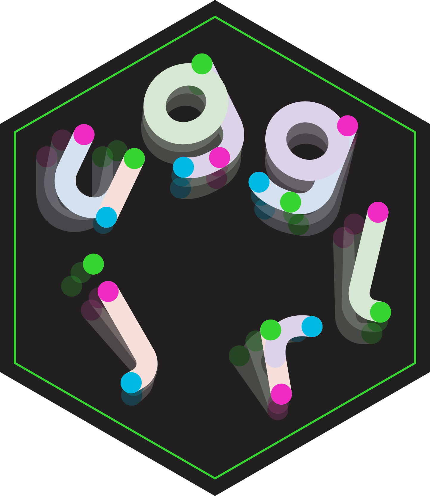

## {background-image="images/learning.png" background-size="contain"}

```{r}
#| label: setup
#| include: false
knitr::opts_chunk$set(message = TRUE)
```

## {background-image="images/juggling.png" background-size="contain"}

## {background-image="images/maths.png" background-size="contain"}

## {background-image="images/packages.png" background-size="contain"}

## {background-image="images/jugglr-interest.png" background-size="contain"}

# siteswap {.inverse .center-h .larger200}

## {background-image="images/3.gif" background-size="33%" background-position="50% 80%"}

## [33333...]{.larger250 .dark} {background-image="images/3.gif" background-size="33%" background-position="50% 80%"}

## [3]{.larger250 .dark} {background-image="images/3.gif" background-size="33%" background-position="50% 80%"}

## [4]{.larger250 .dark} {background-image="images/4.gif" background-size="33%" background-position="50% 80%"}

## [423]{.larger250 .dark} {background-image="images/423.gif" background-size="33%" background-position="50% 80%"}

## [(4,4)]{.larger250 .dark} {background-image="images/4s.gif" background-size="33%" background-position="50% 80%"}

## [(4x,4x)]{.larger250 .dark} {background-image="images/4x4x.gif" background-size="33%" background-position="50% 80%"}

## [(4,4)(4x,4x)]{.larger250 .dark} {background-image="images/44x.gif" background-size="33%" background-position="50% 80%"}

## [[54]24]{.larger250 .dark} {background-image="images/54_24.gif" background-size="33%" background-position="50% 80%"}

## [(2,6x)([6x4x],2x)]{.larger250 .dark} {background-image="images/sync_multi.gif" background-size="33%" background-position="50% 80%"}

## [<3p|3p>]{.larger250 .dark} {background-image="images/3p.gif" background-size="33%" background-position="50% 80%"}

# {.center-h}



[**ellakaye.github.io/jugglr**](https://ellakaye.github.io/jugglr){.larger200}

## Create and validate (juggleable) siteswap

```{r}
library(jugglr)
ss423 <- siteswap("423")
ss423
```


## Create and validate (juggleable) siteswap

```{r}
ss444x4x <- siteswap("(4,4)(4x,4x)")
ss444x4x
```

## Create and validate (unjuggleable) siteswap

```{r}
ss432 <- siteswap("432")
ss432
```

## Visualise with `timeline`

```{r}
timeline(ss423)
```

## Visualise with `timeline`

```{r}
timeline(ss432)
```

## Visualise with `timeline`

```{r}
timeline(ss444x4x)
```

## Visualise with `ladder`

```{r}
ladder(ss423)
```

## Visualise with `ladder`

```{r}
ladder(ss432)
```

## Visualise with `ladder`

```{r}
ladder(ss444x4x)
```

## Animations

A wrapper to the [JugglingLab GIF server](https://jugglinglab.org/html/animinfo.html).

In RStudio/Positron, by default the GIF will be displayed in the Viewer pane. Set a `path` to save the file.

```{r}
#| eval: false
animate(
  ss423,
  colors = c("#D4006A", "#006AD4", "#00D46A"),
  path = "images/423.gif"
)
```

# S7 {.inverse .center-h .larger200}

:::{.notes}
OOP, combines best of S3 and S4, whilst attempting to avoid hte pitfalls of each
:::

## {.center-h .larger250 .center}

[object]{.pink}

. . .

[class]{.blue}

. . .

[generic]{.purple}

. . .

[method]{.orange}

## Class structure

```
Siteswap  
├── vanillaSiteswap
├── synchronousSiteswap
├── multiplexSiteswap
├── synchronousMultiplexSiteswap
└── passingSiteswap
```

. . .

<br>

```{r}
class(ss423)
```


:::{.notes}
ss423 gets parent class and S7

Recall `siteswap` rather than class constructor.
:::

## Helper to assign correct class

```{r}
#| eval: false
#| label: siteswap-fn
#| code-line-numbers: "1-13|2-3|4-7"
siteswap <- function(sequence) {
  if (is_vanilla_notation(sequence)) {
    vanillaSiteswap(sequence)
  } else if (is_sync_notation(sequence)) {
    synchronousSiteswap(sequence)
    ...
  } else {
    cli::cli_abort(
      "Not valid vanilla, synchronous,..., siteswap notation.",
      class = "jugglr_error_not_valid_siteswap"
    )
  }
}
```

## `Siteswap`

```{r}
library(S7)
Siteswap <- new_class(
  "Siteswap",
  properties = list(
    sequence = class_character
  )
)
```

. . .

In S7 v0.2.2.9000, named bindings:

```{r}
#| eval: false
Siteswap := new_class(
  properties = list(...)
)
```

:::{.notes}
Building simplified versions of `Siteswap` and `vanillaSiteswap` class in these slides.
The versions in jugglr have more properties and defined,
as well as methods and generics.

:::

## `Siteswap` with property validator

```{r}
#| code-line-numbers: 4-11
Siteswap <- new_class(
  "Siteswap",
  properties = list(
    sequence = new_property(
      class = class_character,
      validator = function(value) {
        if (length(value) != 1) {
          "must be length 1"
        }
      }
    )
  )
)
```


## Validation in practice

```{r}
#| error: true
Siteswap("423")
Siteswap(423)
Siteswap(c("423", "3"))
```

## `vanillaSiteswap` with computed properties and class validator

```{r}
#| echo: false
chr_throws_to_num <- function(throws) {
  match(tolower(throws), c(0:9, letters)) - 1
}

get_throws <- function(sequence) {
  throws_chr <- strsplit(sequence, "") |>
    unlist()

  chr_throws_to_num(throws_chr)
}

can_throw <- function(throws) {
  n <- length(throws)
  lands <- ((seq_len(n) - 1) + throws) %% n
  anyDuplicated(lands) == 0
}

is_whole_number <- function(x) {
  x %% 1 == 0
}

is_vanilla_notation <- function(sequence) {
  stringr::str_detect(sequence, "^[a-zA-Z0-9]+$")
}
```

```{r}
#| code-line-numbers: 1-3|4-10|11-16|17-22|23-28
vanillaSiteswap <- new_class(
  "vanillaSiteswap",
  parent = Siteswap,
  properties = list(
    throws = new_property(
      class = class_integer,
      getter = function(self) {
        get_throws(self@sequence) # e.g. "423" -> c(4, 2, 3)
      }
    ),
    n_props = new_property(
      class = class_numeric,
      getter = function(self) {
        mean(self@throws)
      }
    ),
    valid = new_property(
      class = class_logical,
      getter = function(self) {
        can_throw(self@throws) && is_whole_number(self@n_props)
      }
    )
  ),
  validator = function(self) {
    if (!is_vanilla_notation(self@sequence)) {
      "@sequence must only contain digits and letters."
    }
  }
)
```

:::{.notes}
Can use ealier defined properties in later prop definitions
:::

## vanillaSiteswap

```{r}
ss423 <- vanillaSiteswap("423")
ss423
```

. . .

```{r}
#| error: true
ss423@n_props <- 4
```

:::{.notes}
Note no print method!
:::

# S7 in packages {.inverse .center-h .larger200}

::: {.notes}
85 out of 24,000 packages import S7 (0.35%) 

ggplot2, ellmer
:::

## Importing S7 and its functions

`DESCRIPTION`:

```
Imports: S7
```

`jugglr-package.R`:

```{r}
#| eval: false
#' @import S7
NULL
```

## Registering methods: don't `@export`!

:::: {.columms}

::: {.column width="45%"}
### Release (0.2.2)
in any `.R` file:

```{r}
#| eval: false
.onLoad <- function(...) {
  methods_register()
}
```

:::

:::{.column width="10%"}
:::

::: {.column width="45%"}
### Dev (0.2.2.9000)
in `zzz.R`:

```{r}
#| eval: false
.onLoad <- function(...) {
  S7::S7_on_load()
}

.onUnload <- function(...) {
  S7::S7_on_unload()
}

S7::S7_on_build()
```
:::
::::

:::{.notes}
Unlike S3/S4, S7 method dispatch is not wired through NAMESPACE — it registers at load time. Without this, methods silently don't dispatch.

zzz.R because it loads last (S7_on_build needs to be called after methods have been registered)
:::

## Package name in all classes

```{r}
#| eval: false
#| code-line-numbers: "1,6"
Siteswap <- new_class(
  "Siteswap",
  properties = list(
    ...
  )
  package = "jugglr"
)
```

## Documentation

roxygen2 8.0.0 provides [first-class support for S7](https://roxygen2.r-lib.org/articles/rd-S7.html).

In `DESCRIPTION`:

```
Config/roxygen2/version: 8.0.0
Config/roxygen2/markdown: TRUE
```

## What to document

:::{.incremental}
- **Generics**: mention that the function is a generic and list the available methods.
  - `doclistling::methods_list()`
- **Methods**: link back to the generic; only document individually when the method has unique behavior or arguments.
- **Classes**: document the constructor 
  - `@param` for constructor arguments
  - `@prop` for additional (e.g. read-only computed) properties
  - `@export`
:::

## Subclasses must be defined after parent class

In `vanillaSiteswap.R`:

```{r}
#| eval: false
#' @include siteswap.R
#' @include utils.R
NULL
```

This generates `DESCRIPTION` field:

```
Collate:
    'utils.R'
    'siteswap.R'
    'vanillaSiteswap.R'
```

:::{.notes}
The order in which files are loaded matters

Alphabetical unless told otherwise with `Collate`
:::

# Key takeaway {.inverse .center-h .larger200}

## {background-image="images/juggling-end.png" background-size="contain"}

## {background-image="images/S7-end.png" background-size="contain"}

## {background-image="images/jugglr-takeaway.png" background-size="contain"}

# An awesome last slide {.inverse .center-h .larger200}
